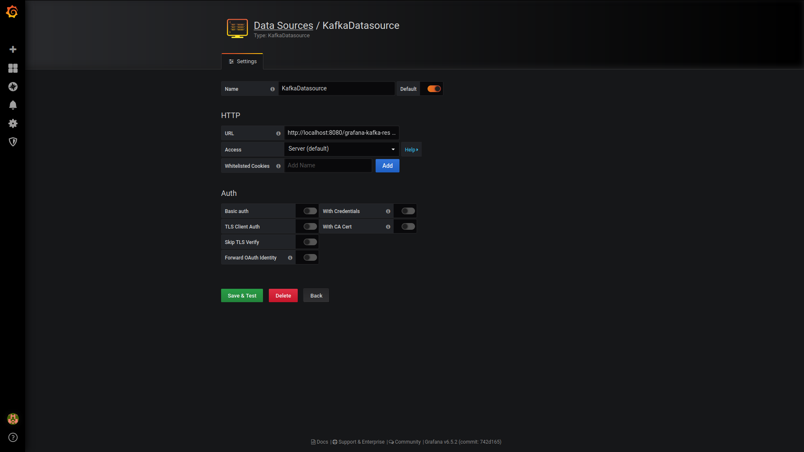
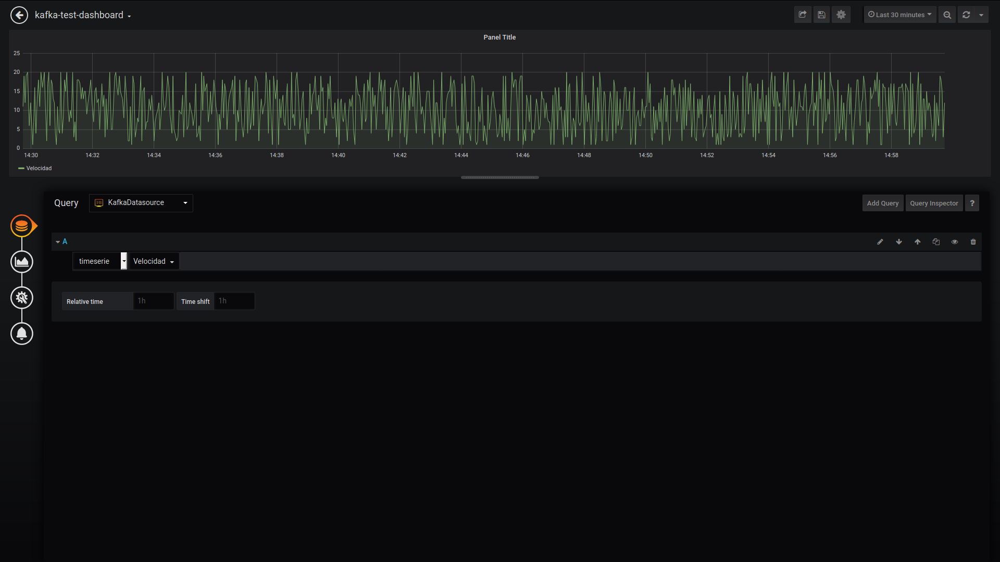
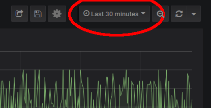

# Lorca

The aim of this proyect is to consume events from Kafka with Grafana. Those events, published in a Kafka topic, must be in avro format and must have:

 * An int ```id``` field, unique for each variable to identify the current event (```id```=1 -> "Grosor", ```id```=2 -> "Aceleración", etc).
 * An int/double timeserie's ```value``` field.
 * A long ```timestamp``` field.

### REST Service

A jaxrs java war which exposes kafka events to Grafana on http://server-name/grafana-kafka-rest/api/v1/1. This jaxrs REST service implements:

 * /, necessary to test the datasource from grafana gui.
 * /search, returns an array of the possible timeserie's values.
 * /query, returns the datapoints to plot.
 * /... Optional methods not implemented yet.

### Grafana Kafka datasource plugin

The javascript project that implements the datasource connector. To deploy into an existing Grafana service:

 * First build the binary with
 ```bash
 yarn build
 yarn install
 ```
 * Then copy dist and other resources to grafana's plugin directory.
 * Restart grafana.

The REST base endpoint is http://server-name/grafana-kafka-rest/api/v1/1.

## Development

Link the plugin with grafana:

```bash
sudo ln -s ~/git/lorca/kafka-datasource-plugin /var/lib/grafana/plugins/kafka-datasource-plugin
```

Then restart grafana:

```bash
sudo systemctl status grafana-server
```

## Test Example

1. Generate avro events from NiFi and publish them to a Kafka topic.
2. Configure REST api with Kafka properties and add war to a tomcat server.
3. Configure ```kafka-datasource-plugin``` from Grafana's GUI.

### 1. Generate events in NiFi

 * #####  GenerateFlowFile:

    Property | Value
    --- | ---
    Custom Text | {"id": ${random():mod(4):plus(1)}, "value": ${random():mod(20):plus(1)}, "timestamp": ${now():toNumber()}}

 * ##### ConvertRecord:

    Property | Value
    --- | ---
    RecordReader | JsonPathReader
    RecordWriter | AvroRecordSetWriter

    - ###### JsonPathReader

      Property | Value
      --- | ---
      Schema Access Strategy | Use 'Schema Text' Property
      Schema Text | {"type": "record","name": "RawEvent","fields":[{"name": "id","type": ["null","int"],"default": null}, {"name": "value","type": ["null","double"],"default": null}, {"name": "timestamp","type": ["null","long"],"default": null}]}
      id | $.id
      timestamp | $.timestamp
      value | $.value

    - ###### AvroRecordSetWriter

      Property | Value
      --- | ---
      Schema Write Strategy | Do Not Write Schema
      Schema Access Strategy | Use 'Schema Text' Property
      Schema Text | {"type": "record","name": "RawRecord","fields":[{"name": "id","type": ["null","int"],"default": null}, {"name": "value","type": ["null","double"],"default": null}, {"name": "timestamp","type": ["null","long"],"default": null}]}

 * ##### PublishKafka:

    Property | Value
    --- | ---
    Kafka Brokers | kafka.broker01:6667, kafka.broker02:6667
    Topic Name | RAW-EVENT


### 2. Configure REST api

Open ```~/lorca-parent/grafana-kafka-rest/src/main/resources/lorca-kafka-rest.yaml``` file and configure properties.

```yaml
kafka-datasources:
   1:
      kafka-native:
                     bootstrap.servers: "kafka.broker01:6667,kafka.broker02:6667"
                     group.id: "grafanaConsumerGroup01"
                     key.deserializer: "org.apache.kafka.common.serialization.StringDeserializer"
                     value.deserializer: "net.zylklab.grafana.kafka.avro.AvroRawEventDeserializer"
                     max.poll.records: 1000
                     enable.auto.commit: false
                     auto.offset.reset: "latest"
      topic-name: "RAW-EVENT"
      topic-partitions-number: 2
      avro-schema: "{\"type\": \"record\",\"namespace\": \"net.zylklab.grafana.kafka.avro.auto\",\"name\": \"EventRecord\",\"fields\":[{\"name\": \"id\",\"type\": [\"null\",\"int\"], \"default\": null},{\"name\": \"value\", \"type\": [\"null\",\"double\"], \"default\": null},{\"name\": \"timestamp\", \"type\": [\"null\",\"long\"], \"default\": null}]}"

      timestamp-field: "timestamp"
      value-field: "value"
      id-field: "id"
      value-type: "double"
      vars: [
               {"key": 1, "value": "Grosor"},
               {"key": 2, "value": "Aceleración"},
               {"key": 3, "value": "Velocidad"},
               {"key": 4, "value": "Longitud"}
            ]
      kafka-version: "2.0.0"
```

Use Tomcat to deploy the REST api.

### 3. Configure plugin from Grafana's GUI

Download and install Grafana from https://grafana.com/docs/grafana/latest/installation/.

 * Start Grafana service:

  ```bash
  sudo systemctl start grafana-server.service
  ```
  Go to ```localhost:3000```.

 * Add kafka-datasource-plugin:

  Left-side panel -> ```Configuration``` -> ```Data Sources```. Click on ```Add data source``` and select ```KafkaDatasource```.

  URL | http://localhost:8080/grafana-kafka-rest/api/v1/1
  --- | ---

  -> ```Save & Test```.

  

 * Add new dashboard:

  Left-side panel -> ```Create``` -> ```Dashboard```.
  Click on ```Add Query``` and select ```KafkaDatasource``` in the ```Query``` field.

  Select desired variable to plot in ```select metric``` drop-down list. Available options are specified in the REST configuration ```lorca-kafka-rest.yaml``` file in ```vars``` field. Each variable is mapped with the ```id``` field from the raw event.

  

  Finally, in the top right corner it is possible to select the desired time range to be plotted.

  
